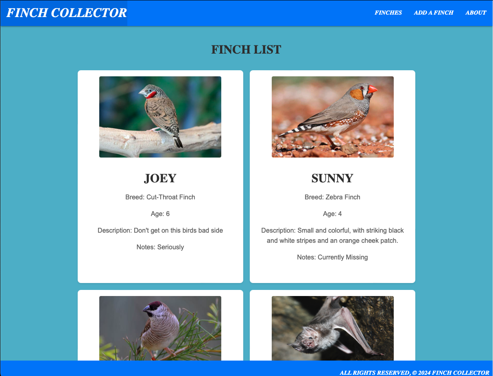

# FinchCollector 

## Features

- **Navigation Bar**: Easily navigate to the different pages of the application including About and All Finches.
- **About Page**: Find details about the FinchCollector application, its purpose, and how to use it.
- **All Finches Page**: View a list of all finches in the database with their attributes displayed.
- **Finch Details**: Click on a finch card to see a detailed view of all its attributes including a list of feedings.
- **Manage Finches**: Add, edit, and remove finches from your collection through Class Based Views.
- **Feedings**: On the detail page of a finch, add feedings to track when and what your finch has been fed.
- **Toys**: View a list of toys, add toys to the database, and manage toys associated with each finch.

## 